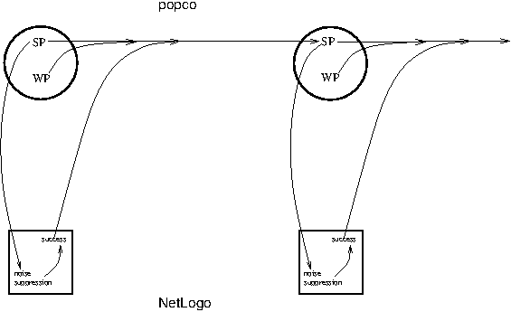
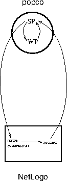
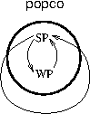

ArchitectureNotes7.md
====
Distillation of ArchitectureNotes6.md, q.v. for additional info.

----

key:

	SP: spiritual peasant propositions
	SB: spiritual brahmanic propositions
	WP: worldly peasant propositions
	WB: worldly brahmanic propositions

----

2. WP=>SP: High activation of WP (vs SB) should bias transmission toward
SP (vs. WB).  

3. Success should bias transmission of whatever the successful
individual believes (`trustworthiness`).  

4. Noise-suppression in NetLogo should be linked to (e.g.) mean activn
of SP in popco:  In a linked simulation, the spiritual float value
for a subak should be a function of its mean SP activn.  

5. As a result, success (yield) in NetLogo will be correlated with mean
activn of SP (under conditions that allow the spiritual float to
have an effect).  

Here's the pattern, with arrows representing causal influence, and
representing popco subaks ("persons") with circles, and NetLogo subaks
with squares:

which can be summarized like this, using a circle and a rectangle to
represent the popco and NetLogo subak classes, respectively:

(Note that "SP" in these figures is playing two roles: It represents both
activations of individual spiritual-peasant propositions, and the mean
activation of all spiritual-peasant propositions.)

i.e. this is how the combined NetLog-popco Bali system should work:

1. Only WP, not WB propns are present in popco.  they are pushed up by
the environment.  This biases transmission of SP over SB.  (Note that
not all of the WP propns are really what one would *observe* "in
nature".  Some of the propns capture ways of thinking about subaks, for
example.  However, if we think of the subak system as pre-existing, but
without ideal religious values, it still makes sense to have the WP
propns emphasized by the env.  Not doubt the real evolution was more
subtle, and maybe it would be worth modeling that later.)

2. When mean SP activn is high, spiritual float in NetLogo is high.

3. When there is a nonzero ignore-pestneighbor probability, the
spiritual float for an individual makes the prob of ignoring
pestneighbors lower.

4. This lowering due to the spiritual float will make sucess more likely.

5. Transmission is further biased by success.  i.e. there is a
trustworthiness variable or other function in popco that is a function
of yield in NetLogo.

------

A popco-only analogue of the preceding is to simply cause
trustworthiness in popco to be a function of mean SP activation.  (This
does not obviate the value of doing a full linked simulation; see
ArchitectureNotes6.md.)

1. Only WP, not WB propns are present in popco.  This biases
transmission of SP over SB.

2. When a sender's mean SP activn is high, its trustworthinesss is high.

i.e. this just creates a loop within popco from the loop that went from
SP to noise suppression to success to SP in the NetLogo-popco system
(using a circle to represent the class of all popco subaks):

(Again, "SP" plays two roles, representing represents both individual
spiritual-peasant propositions activations and mean activation of all
spiritual-peasant propositions.)

-------

On success bias in popco:  Maybe the success bias ("trustworthiness")
should a convex or S-shaped function of per-subak mean spiritual-peasant
activations--rather than a linear function.  Why?  Because analogies
really work when they are mostly complete.

-------

Note that what I'm calling success bias above is a simple change in
probability of transmission, whereas the kind of success bias
implemented in the NetLogo Bali model is imitate-the-best, where best is
from a subset of the population that varies per person, and maybe per
imitation trial.  The latter can be mapped onto prob of transmission,
but not in a simple way, and it will vary per person.  At the moment
(early December 2014), crop plan imitation is constrained purely by
network structure, while I allow spiritual value imitation to be
constrained by mixture of network and sampling from the entire
population.

See SuccessBias.md in the popco2 repo for notes on different ways to
implement success bias in popco2.

-------

Note that the mixture between pestneighbors and a sample from the entire
population will be difficult to implement in popco.  I don't want to do
that at all.  Popco is fine with a fixed network structure, and could be
made to change network structures from tick to tick without a lot of
trouble (this could probably done with a function mapped through the
`many-times` sequence, like the reporter functions).  But the
pestneighbor/global mixture is essentially a combination of two network
structures (the pestneighbor network and no network).  Sure, I could
implement that as a special case by replacing something in speak.clj or
listen.clj, but I'm reluctant to do that unless this method has
significant theoretical motivation.  The pestneighbor/global mixture was
motivated by the fact that it's implausible, and impractical, to
restrict spiritual transmission to the pestneighbor connections because
there are so many completely isolated subnets.  Maybe I should try doing
spiritual transmission simply as a subset of the entire population.

---------

Hmm note that by implementing the departure from
cooperation/coordination solely as a random noise, there's not really
any benefit to being "selfish".  Hmm.
